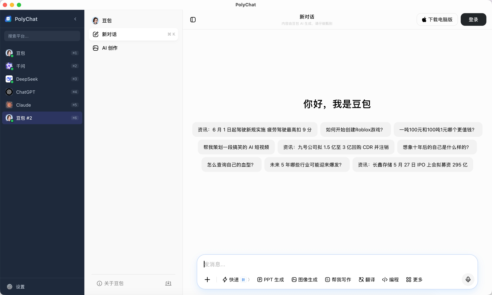

# PolyChat

[English](README.md) | 简体中文

PolyChat 是一个基于 Tauri v2、React 和 TypeScript 的多 AI 对话桌面客户端。它把常用 AI 网页版聚合到一个桌面应用里，每个平台使用独立的系统 WebView 和本地数据目录，方便在侧边栏快速切换和保持登录状态。



上图展示了 PolyChat 的主界面：左侧是应用自己的平台侧边栏，支持搜索、快捷键提示、加载状态和登录分身；右侧是当前平台的原生 WebView。示例中打开的是豆包，页面内容保持平台原有体验，同时可以通过侧边栏快速切换到千问、DeepSeek、ChatGPT 或 Claude。

## 默认平台

当前默认保留 5 个平台：

- 豆包
- 千问
- DeepSeek
- ChatGPT
- Claude

用户仍可在设置中添加、编辑、复制、禁用、删除或排序自定义平台。

## 特性

- **系统 WebView**：基于 Tauri v2，使用 WKWebView / WebView2 / WebKitGTK，不内置 Chromium。
- **多平台常驻**：启用的平台会保持 WebView 实例，切换平台时尽量避免页面重载。
- **登录持久化**：平台数据写入 `app_data_dir/platforms/{platform_id}`，不同平台默认独立保存登录态。
- **平台内多标签**：跨域新窗口和外部链接会转成应用内标签页，支持关闭当前标签或关闭全部非主标签。
- **快捷键切换**：`Ctrl/Cmd + 1~9` 切换平台，`Ctrl/Cmd + Tab` 在当前平台的标签页间切换，`Ctrl/Cmd + Shift + [ / ]` 在当前平台的历史会话间切换，`Ctrl/Cmd + Q` 退出。
- **下载处理**：原生下载和页面 `a[download]` / Blob 下载会保存到系统 Downloads，并显示下载完成或失败提示。
- **数据清理**：可在平台顶部操作中清除当前平台登录状态和浏览数据。
- **外部打开**：可把当前页面交给系统默认浏览器打开。
- **平台管理**：设置窗口支持启用、禁用、编辑 URL、复制登录分身、拖拽排序和恢复默认设置。
- **分屏与广播**（默认关闭，可在设置中开启）：以网格方式同时并排显示多个平台，并把同一段提问一键广播到所有可见平台（自动填充并发送）。
- **Prompt 模板库**：把常用提示词存为模板，支持 `{{变量}}` 占位符，在广播框一键选用；选中模板会填入输入框（不直接发送），可再编辑后广播。

## 快速开始

### 环境要求

- Node.js 和 npm
- Rust 工具链
- Tauri v2 所需系统依赖

Linux 开发和打包需要额外安装 WebKitGTK 等依赖，通常包括 `libwebkit2gtk-4.1-dev`、`libgtk-3-dev`、`libayatana-appindicator3-dev`、`librsvg2-dev` 等。

### 开发

```bash
npm install
npm run dev
```

`npm run dev` 会启动 Vite dev server，并由 Tauri 打开桌面窗口。

只启动前端开发服务器：

```bash
npm run dev:vite
```

### 构建

```bash
# 前端类型检查和 Vite 构建
npm run build:vite

# 构建当前平台 app bundle
npm run build

# macOS DMG
npm run tauri:build:dmg
```

Tauri bundle 目标配置为 `dmg`、`nsis`、`appimage`、`deb`。

## 使用说明

### 切换平台

左侧侧边栏显示所有启用平台。点击平台即可切换，也可以使用 `Ctrl/Cmd + 1~9` 按顺序快速切换。

### 管理平台

点击侧边栏底部的设置按钮进入平台管理。可执行：

- 添加平台
- 启用或禁用平台
- 编辑名称、URL、描述和 User-Agent
- 复制平台作为独立登录分身
- 删除平台
- 拖拽调整顺序
- 恢复默认平台和配置

### 登录和清理数据

首次打开平台时，在网页中正常登录即可。登录态会保存在本地数据目录中。

如果需要切换账号或清除登录状态，点击平台顶部操作区的清理按钮，应用会清除该平台的 `localStorage`、`sessionStorage` 和 WebView 浏览数据。

### 下载文件

应用会把下载保存到系统 Downloads 目录，并在侧边栏区域显示 toast 提示。成功下载时可点击“打开文件夹”。

下载文件名优先使用 WebView/服务端建议文件名；如果站点只给出通用下载 URL，会从 URL 参数中尝试提取 `filename`、`name`、`title` 或 `Content-Disposition` 形式的文件名。

## 架构

### 前端

- `src/App.tsx`：应用根组件，负责侧边栏、平台 WebView 容器、设置窗口和下载提示。
- `src/components/Sidebar/`：平台列表、折叠状态、加载状态展示。
- `src/components/WebViewContainer/`：创建和同步原生 WebView bounds，处理平台内标签页和导航操作。
- `src/components/SettingsModal/`：平台和常规配置管理。
- `src/components/AddPlatformModal/`：添加自定义平台。
- `src/components/BroadcastInput/`：分屏广播输入框与 Prompt 模板库。
- `src/store/platformStore.ts`：Zustand 状态管理，并持久化到 `localStorage`。
- `src/runtime/desktop.ts`：前端调用 Tauri commands 和监听事件的封装。

### Rust / Tauri

- `src-tauri/src/lib.rs`：管理原生 WebView 生命周期、平台数据目录、下载处理、标签拦截、快捷键桥接和浏览数据清理。
- `src-tauri/tauri.conf.json`：窗口、构建和 bundle 配置。
- `src-tauri/capabilities/default.json`：Tauri capability 权限配置。

核心后端状态为 `Mutex<HashMap<String, PlatformView>>`，每个平台或平台内标签对应一个原生 WebView。React 负责布局，Rust 根据前端传入的 bounds 同步原生 WebView 的位置和大小。

## Tauri Commands

前端通过 `src/runtime/desktop.ts` 调用这些核心命令：

- `create_platform_view`
- `show_platform_view`
- `show_platform_views`
- `hide_all_platform_views`
- `close_platform_view`
- `set_platform_view_bounds`
- `navigate`
- `fill_platform_input`
- `open_external`
- `clear_platform_data`
- `get_platform_state`
- `open_platform_tab`
- `dispatch_shortcut`
- `switch_conversation`
- `save_download_blob`
- `report_download_error`
- `quit_app`

Rust 会向前端发送这些主要事件：

- `platform-state-changed`
- `platform-open-tab-requested`
- `platform-download-finished`
- `polychat-shortcut`

## 项目结构

```text
polychat/
├── src/
│   ├── App.tsx
│   ├── App.css
│   ├── main.tsx
│   ├── config/
│   │   └── defaults.ts
│   ├── runtime/
│   │   └── desktop.ts
│   ├── store/
│   │   └── platformStore.ts
│   ├── types/
│   │   └── index.ts
│   ├── utils/
│   │   └── platformIcons.ts
│   └── components/
│       ├── AddPlatformModal/
│       ├── BroadcastInput/
│       ├── SettingsModal/
│       ├── Sidebar/
│       └── WebViewContainer/
├── src-tauri/
│   ├── src/
│   │   ├── main.rs
│   │   └── lib.rs
│   ├── capabilities/
│   │   └── default.json
│   ├── Cargo.toml
│   └── tauri.conf.json
├── public/
├── package.json
├── vite.config.ts
├── tsconfig.json
└── tsconfig.node.json
```

## 技术栈

- Tauri v2
- React 18
- TypeScript 5
- Vite 6
- Zustand 4
- Rust 2021

## 许可

MIT
